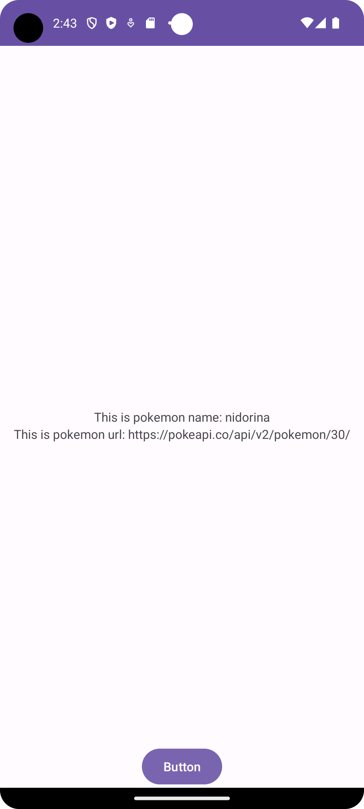
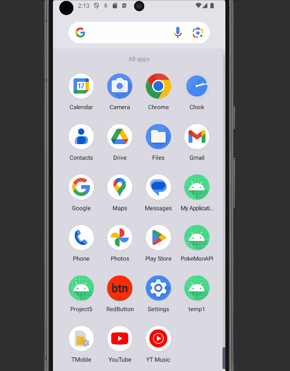

# PokeMonAPI

<!-- (This is a comment) INSTRUCTIONS: Go through this page and fill out any **bolded** entries with their correct values.-->

# AND101 Project 6 - CYOAPI Part 2: RecyclerView Edition

Submitted by: **rachel todd**

Time spent: **20** hours spent in total

## Summary

**Pokemon Scrollable** is an android app that **fill in description (Example: "An app that displays a scrollable list of characters from the pokemon API")**

If I had to describe this project in three (3) emojis, they would be: **help, help, help**

## Application Features

<!-- (This is a comment) Please be sure to change the [ ] to [x] for any features you completed.  If a feature is not checked [x], you might miss the points for that item! -->

The following REQUIRED features are completed:

- [x] Make an API call to an API of your choice using AsyncHTTPClient
- [ ] Implement a RecyclerView to display a list of entries from the API
- [ ] Display at least three (3) pieces of data for each RecyclerView item

The following STRETCH features are implemented:

- [ ] Add a UI element for the user to interact with API further
- [ ] Show a `Toast` or `Snackbar` when an item is clicked
- [ ] Add item dividers with `DividerItemDecoration`

The following EXTRA features are implemented:

- [ ] List anything else that you added to improve the app!

## Video Demo

Here's a video / GIF that demos all of the app's implemented features:

GIF created with **screentogif**

<!-- Recommended tools:
- [Kap](https://getkap.co/) for macOS
- [ScreenToGif](https://www.screentogif.com/) for Windows
- [peek](https://github.com/phw/peek) for Linux. -->

## Notes

Here's a place for any other notes on the app, it's creation process, or what you learned this unit!

I don't understand how to implement recyclerview without images. The lab was perfectly fine but I don't understand how each component works together to create scrolling text.

## License

Copyright **2023** **rachel**

Licensed under the Apache License, Version 2.0 (the "License");
you may not use this file except in compliance with the License.
You may obtain a copy of the License at

    http://www.apache.org/licenses/LICENSE-2.0

Unless required by applicable law or agreed to in writing, software
distributed under the License is distributed on an "AS IS" BASIS,
WITHOUT WARRANTIES OR CONDITIONS OF ANY KIND, either express or implied.
See the License for the specific language governing permissions and
limitations under the License.

<!-- (This is a comment) INSTRUCTIONS: Go through this page and fill out any **bolded** entries with their correct values.-->

# AND101 Project 5 - Choose Your Own API

Submitted by: **Rachel Todd**

Time spent: **10** hours spent in total

## Summary

**Name of your app** is an android app that **fill in description (Example: "An app that displays a random character from the Game of Thrones API")**

If I had to describe this project in three (3) emojis, they would be: **confused, scared, happy**

## Application Features

<!-- (This is a comment) Please be sure to change the [ ] to [x] for any features you completed.  If a feature is not checked [x], you might miss the points for that item! -->

The following REQUIRED features are completed:

- [x] Make an API call to an API of your choice using AsyncHTTPClient
- [x] Display at least three (3) pieces of data for each API entry retrieved
- [x] A working Button requests a new API entry and updates the data displayed

The following STRETCH features are implemented:

- [x] Add a query to the API request
  - The query I added is **FILL IN HERE**
- [x] Build a UI to allow users to add that query

The following EXTRA features are implemented:

- [ ] List anything else that you added to improve the app!

## API Choice

My chosen API for this project is **pokeApi**.

## Video Demo

Here's a video / GIF that demos all of the app's implemented features:

GIF created with **screenToGIF**

<!-- Recommended tools:
- [Kap](https://getkap.co/) for macOS
- [ScreenToGif](https://www.screentogif.com/) for Windows
- [peek](https://github.com/phw/peek) for Linux. -->

## Notes

Here's a place for any other notes on the app, it's creation process, or what you learned this unit!

## License

Copyright **2023** **Rachel Todd**

Licensed under the Apache License, Version 2.0 (the "License");
you may not use this file except in compliance with the License.
You may obtain a copy of the License at

    http://www.apache.org/licenses/LICENSE-2.0

Unless required by applicable law or agreed to in writing, software
distributed under the License is distributed on an "AS IS" BASIS,
WITHOUT WARRANTIES OR CONDITIONS OF ANY KIND, either express or implied.
See the License for the specific language governing permissions and
limitations under the License.
